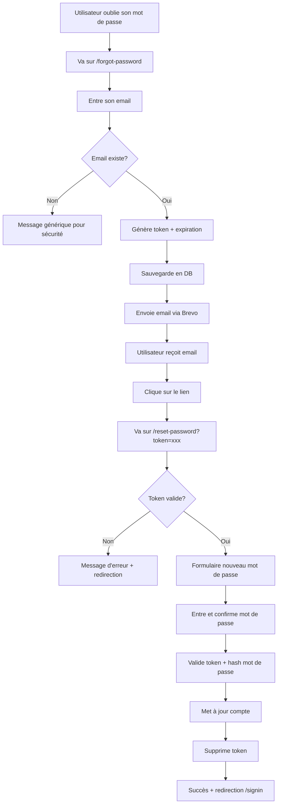

# 🔐 Guide du Système de Réinitialisation de Mot de Passe

## Vue d'ensemble

Le système de réinitialisation de mot de passe est maintenant **complètement opérationnel** avec :
- ✅ Génération de tokens sécurisés
- ✅ Stockage en base de données PostgreSQL
- ✅ Envoi d'emails via Brevo
- ✅ Expiration automatique des tokens (1 heure)
- ✅ Interface utilisateur responsive
- ✅ Mode développement avec logs

## Architecture

### 1. Pages

#### `/forgot-password`
- Formulaire de demande de réinitialisation
- Validation de l'email
- Envoi du token par email

#### `/reset-password?token=xxx`
- Validation du token
- Formulaire de nouveau mot de passe
- Confirmation du mot de passe
- Mise à jour sécurisée

### 2. API Routes

#### `POST /api/auth/forgot-password`
```typescript
Body: { email: string }
Response: { success: boolean, message: string, devToken?: string }
```
- Vérifie si l'utilisateur existe
- Génère un token unique (32 bytes)
- Sauvegarde le token avec expiration (1h)
- Envoie l'email via Brevo

#### `POST /api/auth/validate-reset-token`
```typescript
Body: { token: string }
Response: { valid: boolean, error?: string }
```
- Vérifie si le token existe
- Vérifie si le token n'est pas expiré

#### `POST /api/auth/reset-password`
```typescript
Body: { token: string, password: string }
Response: { success: boolean, message: string }
```
- Valide le token
- Hash le nouveau mot de passe (scrypt)
- Met à jour le compte Better Auth
- Supprime le token utilisé

### 3. Base de Données

Champs ajoutés au modèle `User` :
```prisma
model User {
  // ... autres champs
  resetToken       String?   // Token de réinitialisation
  resetTokenExpiry DateTime? // Date d'expiration du token
}
```

### 4. Service Email (Brevo)

Fichier : `lib/email.ts`

Fonctions :
- `sendEmail()` : Envoi générique via Brevo API
- `sendPasswordResetEmail()` : Email de réinitialisation avec template HTML

Template inclut :
- Design responsive
- Bouton d'action principal
- Lien de secours
- Avertissement d'expiration
- Footer professionnel

## Flux Utilisateur



## Configuration Brevo

### Étape 1 : Créer un compte
1. Allez sur [brevo.com](https://www.brevo.com/)
2. Créez un compte gratuit (300 emails/jour)

### Étape 2 : Obtenir la clé API
1. Connectez-vous à Brevo
2. Allez dans **Settings** (Paramètres)
3. Cliquez sur **SMTP & API**
4. Onglet **API Keys**
5. Cliquez sur **Generate a new API key**
6. Nommez-la (ex: "Sissan Production")
7. Copiez la clé

### Étape 3 : Vérifier l'email expéditeur
1. Allez dans **Senders & IP**
2. Ajoutez votre domaine ou email
3. Vérifiez via le lien envoyé

### Étape 4 : Configurer .env
```env
BREVO_API_KEY="xkeysib-xxxxxxxxxxxxx"
BREVO_SENDER_EMAIL="noreply@sissan-sissan.net"
```

## Tests

### Mode Développement
```bash
# Le token est affiché dans la console
npm run dev

# Testez /forgot-password
# Regardez la console pour le token
# Utilisez le lien affiché
```

### Mode Production
```bash
# L'email est envoyé via Brevo
npm run build
npm start

# Testez avec un vrai email
# Vérifiez votre boîte de réception
```

## Sécurité

### ✅ Bonnes pratiques implémentées

1. **Token sécurisé** : 32 bytes aléatoires (crypto.randomBytes)
2. **Expiration** : 1 heure maximum
3. **One-time use** : Token supprimé après utilisation
4. **Hash sécurisé** : scrypt pour le mot de passe
5. **Pas de révélation** : Message générique même si email n'existe pas
6. **HTTPS requis** : En production
7. **Rate limiting** : À implémenter si besoin

### 🔒 Recommandations supplémentaires

- Implémenter un rate limiting (max 3 tentatives/heure)
- Logger les tentatives de réinitialisation
- Notifier l'utilisateur des changements de mot de passe
- Ajouter un CAPTCHA si abus détecté

## Personnalisation

### Modifier le template email
Éditez `lib/email.ts` > fonction `sendPasswordResetEmail()`

### Changer la durée d'expiration
```typescript
// Dans /api/auth/forgot-password/route.ts
const resetTokenExpiry = new Date(Date.now() + 3600000) // 1 heure
// Changez 3600000 (1h) en millisecondes désirées
```

### Personnaliser les messages
Éditez les fichiers de traduction dans `lib/translations/`

## Dépannage

### Email non reçu
1. Vérifiez les spams
2. Vérifiez que `BREVO_API_KEY` est correcte
3. Vérifiez que `BREVO_SENDER_EMAIL` est vérifié
4. Consultez les logs Brevo (Dashboard > Logs)

### Token invalide
1. Vérifiez que le token n'a pas expiré (1h)
2. Vérifiez que le token n'a pas déjà été utilisé
3. Consultez la console en mode dev

### Erreur de hash
1. Vérifiez que Node.js >= 16
2. Le module `crypto` est natif, pas besoin d'installer

## Support

Pour toute question :
- Consultez la documentation Brevo : [docs.brevo.com](https://developers.brevo.com/)
- Vérifiez les logs de la console
- Testez d'abord en mode développement

---

✅ **Système de Reset Password 100% Opérationnel !**
